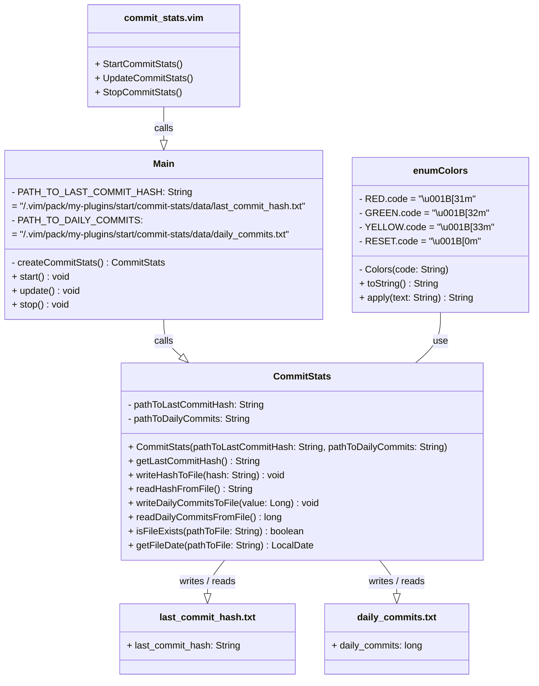

<div align="center">
  <a id="english"></a>
  <h1>Commit stats Vim plugin</h1>
  <p>Vim utility for get commit stats</p>

  [](#english)
  [](#russian)
  
  
  
</div>

<div align="center">
  <h4>Plugin file structure</h4>
</div>

* The plugin installs into the relevant directory of the `.vim/`
folder and creates the following file structure:

```
commit-stats
├── bin
│  ├── main
│  │  ├── Colors.class
│  │  ├── CommitStats.class
│  │  └── Main.class
│  └── test
│     └── CommitStatsTest.class
├── data
├── plugin
│  └── commit_stats.vim
├── README.md
└── src
   ├── main
   │  └── java
   │     ├── Colors.java
   │     ├── CommitStats.java
   │     └── Main.java
   └── test
      └── java
         └── CommitStatsTest.java
```

<div align="center">
  <h4>Manual installation</h4>
</div>

* Copy the plugin to the  `.vim/` folder:
```
cp -r commit-stats/ ~/.vim/pack/my-plugins/start/
```

* Navigate to the plugin's root directory:
```
cd ~/.vim/pack/my-plugins/start/commit-stats/
```

* Compile Java files:
```
javac -d bin/main/ src/main/java/*
```

* Reload Vim or run the command:
```
:source ~/.vim/pack/my-plugins/start/commit-stats/plugin/commit_stats.vim
```

<div align="center">
  <h4>Plugin uninstallation</h4>
</div>

* To uninstall the plugin, delete its folder:
```
rm -r ~/.vim/pack/my-plugins/start/commit-stats/
```

<div align="center">
  <h4>Testing</h4>
</div>

* Check the path to JUnit using command: 
```
dpkg -L junit5 | grep junit-jupiter-api
```
```
dpkg -L junit5 | grep junit-platform-console-standalone
```

* Building tests with JUnit dependencies:
```
javac -d bin/test/ -cp "bin/main:/usr/share/java/junit-jupiter-api-5.10.1.jar:/usr/share/java/junit-platform-console-standalone-1.9.1.jar" src/test/java/*.java
```

* Running all unit tests
```
java -cp "bin/main:bin/test:/usr/share/java/junit-jupiter-api-5.10.1.jar:/usr/share/java/junit-platform-console-standalone-1.9.1.jar" org.junit.platform.console.ConsoleLauncher --scan-classpath --class-path bin/test
```

<div align="center">
  <h4>Using</h4>
</div>

* Use Vim to edit the file:
```
$ vim example.md
```

* After closing Vim, you will see:
```
  =========================================
              Commit stats:
  -----------------------------------------
  - Commits for day: 0
  =========================================
```

<div align="center">
  <h4>Requirements</h4>
</div>
 
* Java installed
* Vim installed
* .class files built into designated folder
* JUnit 5 installed (optional)

<div align="center">
  <h4>Compatibility</h4>
</div>
 
* Vim 7.0 and above
* Java 8 and above

<div align="center">
  <h4>Class call hierarchy</h4>
</div>



<div align="center">
  <a id="russian"></a>
  <h1>Commit stats Vim plugin</h1>
  <p>Vim утилита для получения статистики коммитов</p>

  [](#english)
  [](#russian)
  
  
  
</div>

<div align="center">
  <h4>Структура файлов плагина</h4>
</div>

* Плагин устанавливается в соответствующую директорию папки `.vim/`
и создает следующую структуру файлов:

```
commit-stats
├── bin
│  ├── main
│  │  ├── Colors.class
│  │  ├── CommitStats.class
│  │  └── Main.class
│  └── test
│     └── CommitStatsTest.class
├── data
├── plugin
│  └── commit_stats.vim
├── README.md
└── src
   ├── main
   │  └── java
   │     ├── Colors.java
   │     ├── CommitStats.java
   │     └── Main.java
   └── test
      └── java
         └── CommitStatsTest.java
```

<div align="center">
  <h4>Ручная установка</h4>
</div>

* Скопируйте плагин в папку `.vim/`:
```
cp -r commit-stats/ ~/.vim/pack/my-plugins/start/
```

* Перейдите в корневую директорию плагина:
```
cd ~/.vim/pack/my-plugins/start/commit-stats/
```

* Скомпилируйте Java файлы:
```
javac -d bin/main/ src/main/java/*
```

* Перезагрузите Vim или выполните команду:
```
:source ~/.vim/pack/my-plugins/start/commit-stats/plugin/commit_stats.vim
```

<div align="center">
  <h4>Удаление плагина</h4>
</div>

* Чтобы удалить плагин, удалите его папку:
```
rm -r ~/.vim/pack/my-plugins/start/commit-stats/
```

<div align="center">
  <h4>Тестирование</h4>
</div>

* Проверьте путь до JUnit используя команду: 
```
dpkg -L junit5 | grep junit-jupiter-api
```
```
dpkg -L junit5 | grep junit-platform-console-standalone
```

* Сборка тестов с зависимостями JUnit:
```
javac -d bin/test/ -cp "bin/main:/usr/share/java/junit-jupiter-api-5.10.1.jar:/usr/share/java/junit-platform-console-standalone-1.9.1.jar" src/test/java/*.java
```

* Запуск всех юнит-тестов:
```
java -cp "bin/main:bin/test:/usr/share/java/junit-jupiter-api-5.10.1.jar:/usr/share/java/junit-platform-console-standalone-1.9.1.jar" org.junit.platform.console.ConsoleLauncher --scan-classpath --class-path bin/test
```

<div align="center">
  <h4>Использование</h4>
</div>

* Воспользуйтесь Vim для редактирования файла:
```
$ vim example.md
```

* После закрытия Vim, вы увидите:
```
  =========================================
              Commit stats:
  -----------------------------------------
  - Commits for day: 0
  =========================================
```

<div align="center">
  <h4>Требования</h4>
</div>
 
* Установленная Java 
* Установленный Vim 
* Скомпилированные .class файлы в соответствующей папке
* Установленный JUnit 5 (опционально)

<div align="center">
  <h4>Совместимость</h4>
</div>
 
* Vim 7.0 и выше
* Java 8 и выше

<div align="center">
  <h4>Иерархия классов</h4>
</div>


