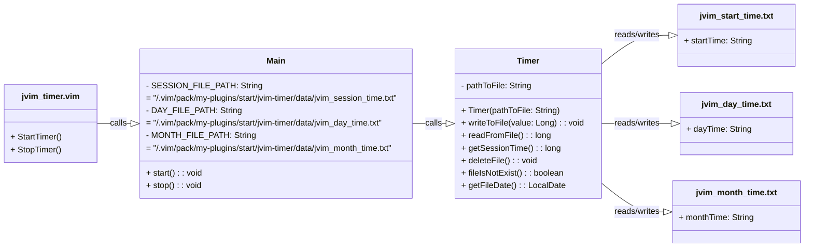

<div align="center">

  <a id="english"></a>
  <h1>Simple Vim Working Time Measurement Plugin</h1>
  <p>Designed for self-monitoring and productivity</p>

  [](#english)
  [](#russian)
  
  
  
  

</div>

<div align="center">
  <h4>Installation</h4>
</div>
 
* Save the plugin folder `jvim-timer/` to the directory  
`~/.vim/pack/my-plugins/start/`:

```
~/.vim/
└── pack/
    └── my-plugins/
        └── start/
            └── jvim-timer/
                ├── bin/
                │   ├── main/
                │   │   ├── Main.java.class
                │   │   └── Timer.class
                │   └── test/
                │       └── TimerTest.class
                ├── data/
                │   ├── jvim_day_time.txt
                │   ├── jvim_mouth_time.txt
                │   └── jvim_session_time.txt
                ├── plugin/
                │   └── jvim_timer.vim
                ├── src/
                │   ├── main/
                │   │   └── java/
                │   │       ├── Main.java
                │   │       └── Timer.java
                │   └── test/
                │       └── java/
                │           └── TimerTest.java
                └── test/
                       └── test_jvim_timer.vim
```

* Compile the Java file:
```
cd ~/.vim/pack/my-plugins/start/jvim-timer/
javac -d bin/main/ src/main/java/*
```

* Reload Vim or execute the command:

```
:source ~/.vim/pack/my-plugins/start/jvim-timer/plugin/jvim_timer.vim
```

<div align="center">
  <h4>Testing</h4>
</div>

* Running tests:
```
cd ~/.vim/pack/my-plugins/start/jvim-timer/
vim -u NONE -S test/test_jvim_timer.vim
```

The script includes comprehensive error handling:
* checking for the existence of data/ directory
* checking file access permission
* handling external command execution errors
* detailed error logging

* Compile tests with JUnit dependencies:
```
javac -d bin/test/ -cp "bin/main:/usr/share/java/junit-jupiter-api-5.10.1.jar:/usr/share/java/junit-platform-console-standalone-1.9.1.jar" src/test/java/*.java
```

* Run all JUnit tests 
```
java -cp "bin/main:bin/test:/usr/share/java/junit-jupiter-api-5.10.1.jar:/usr/share/java/junit-platform-console-standalone-1.9.1.jar" org.junit.platform.console.ConsoleLauncher --scan-classpath --class-path bin/test
```

<div align="center">
  <h4>Usage</h4>
</div>

* Use Vim to edit a file:
```
$ vim example.md
```

* After finishing work and closing Vim, 
the following will be displayed:
```
  =========================================
            Время работы Vim:           
  -----------------------------------------
  - за сеанс:             0 ч  0 мин  2 сек
  - за день:              0 ч 50 мин  3 сек
  - за месяц (среднее):   0 ч 50 мин  3 сек
  =========================================
```

<div align="center">
  <h4>Requirements</h4>
</div>
 
* Installed Java
* Compiled .class files in the specified directory

<div align="center">
  <h4>Compatibility</h4>
</div>
 
* Vim 7.0 and above
* Java 8 and above

<div align="center">
  <h4>jvim-timer class call structure</h4>
</div>



<div align="center">

  <a id="russian"></a>
  <h1>Простой плагин для измерения времени работы Vim</h1>
  <p>Нужен для самоконтроля и производительности</p>

  [](#english)
  [](#russian)
  
  
  
  

</div>

<div align="center">
  <h4>Установка</h4>
</div>
 
* Сохранить папку с плагином `jvim-timer/` в папку 
`~/.vim/pack/my-plugins/start/`:

```
~/.vim/
└── pack/
    └── my-plugins/
        └── start/
            └── jvim-timer/
                ├── bin/
                │   ├── main/
                │   │   ├── Main.java.class
                │   │   └── Timer.class
                │   └── test/
                │       └── TimerTest.class
                ├── data/
                │   ├── jvim_day_time.txt
                │   ├── jvim_mouth_time.txt
                │   └── jvim_session_time.txt
                ├── plugin/
                │   └── jvim_timer.vim
                ├── src/
                │   ├── main/
                │   │   └── java/
                │   │       ├── Main.java
                │   │       └── Timer.java
                │   └── test/
                │       └── java/
                │           └── TimerTest.java
                └── test/
                       └── test_jvim_timer.vim
```

* Скомпилировать Java файлы:
```
cd ~/.vim/pack/my-plugins/start/jvim-timer/
javac -d bin/main/ src/main/java/*
```

* Перезагрузить Vim или выполнить команду:

```
:source ~/.vim/pack/my-plugins/start/jvim-timer/plugin/jvim_timer.vim
```

<div align="center">
  <h4>Тестирование</h4>
</div>

* Запуск тестов:
```
cd ~/.vim/pack/my-plugins/start/jvim-timer/
vim -u NONE -S test/test_jvim_timer.vim
```

Скрипт включает комплексную обработку ошибок:
* проверка существования директории data/
* проверка прав доступа к файлам
* обработка ошибок выполнения внешних команд
* детальное логирование при ошибках

* Компиляция тестов с зависимостями JUnit:
```
javac -d bin/test/ -cp "bin/main:/usr/share/java/junit-jupiter-api-5.10.1.jar:/usr/share/java/junit-platform-console-standalone-1.9.1.jar" src/test/java/*.java
```

* Запуск всех unit-тестов
```
java -cp "bin/main:bin/test:/usr/share/java/junit-jupiter-api-5.10.1.jar:/usr/share/java/junit-platform-console-standalone-1.9.1.jar" org.junit.platform.console.ConsoleLauncher --scan-classpath --class-path bin/test
```

<div align="center">
  <h4>Использование</h4>
</div>

* Воспользоваться Vim для редактирования файла:
```
$ vim example.md
```

* По окончании работы и закрытия Vim будет выведено:
```
  =========================================
            Время работы Vim:           
  -----------------------------------------
  - за сеанс:             0 ч  0 мин  2 сек
  - за день:              0 ч 50 мин  3 сек
  - за месяц (среднее):   0 ч 50 мин  3 сек
  =========================================
```

<div align="center">
  <h4>Требования</h4>
</div>
 
* Установленная Java
* Скомпилированные .class файлы в указанной директории

<div align="center">
  <h4>Совместимость</h4>
</div>
 
* Vim 7.0 и выше
* Java 8 и выше

<div align="center">
  <h4>Структура вызовов классов</h4>
</div>


