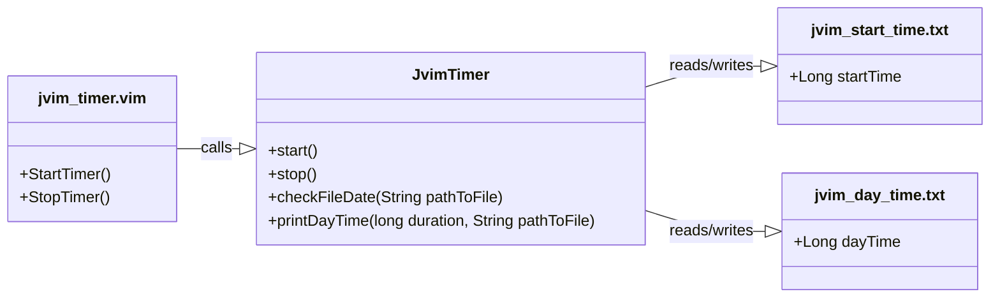

<div align="center">

  <a id="english"></a>
  <h1>Simple Vim Working Time Measurement Plugin</h1>
  <p>Designed for self-monitoring and productivity</p>

  [](#english)
  [](#russian)
  
  
  
  

</div>

<div align="center">
  <h4>Installation</h4>
</div>
 
* Save the plugin folder `jvim-timer/` to the directory  
`~/.vim/pack/my-plugins/start/`:

```
~/.vim/
└── pack/
    └── my-plugins/
        └── start/
            └── jvim-timer/
                ├── plugin/
                │   └── jvim_timer.vim
                ├── java/
                │   └── JvimTimer.java
                └── data
```

* Compile the Java file:
```
cd ~/.vim/pack/my-plugins/start/jvim-timer/java/
javac JvimTimer.java
```

* Reload Vim or execute the command:

```
:source ~/.vim/pack/my-plugins/start/jvim-timer/plugin/jvim_timer.vim
```

<div align="center">
  <h4>Usage</h4>
</div>

* Use Vim to edit a file:
```
  =====================================
            Время работы Vim:           
  -------------------------------------
  - за сеанс:  0 ч  0 мин  2 сек
  - за день:   0 ч 50 мин  3 сек
  =====================================
```

* After finishing work and closing Vim, 
the following will be displayed:
```
$ Время работы Vim: ... ч ... мин ... сек
```

<div align="center">
  <h4>Requirements</h4>
</div>
 
* Installed Java
* Compiled JvimTimer.class in the specified directory

<div align="center">
  <h4>Compatibility</h4>
</div>
 
* Vim 7.0 and above
* Java 8 and above

<div align="center">
  <h4>jvim-timer class call structure</h4>
</div>



<div align="center">

  <a id="russian"></a>
  <h1>Простой плагин для измерения времени работы Vim</h1>
  <p>Нужен для самоконтроля и производительности</p>

  [](#english)
  [](#russian)
  
  
  
  

</div>

<div align="center">
  <h4>Установка</h4>
</div>
 
* Сохранить папку с плагином `jvim-timer/` в папку 
`~/.vim/pack/my-plugins/start/`:
```
~/.vim/
└── pack/
    └── my-plugins/
        └── start/
            └── jvim-timer/
                ├── plugin/
                │   └── jvim_timer.vim
                ├── java/
                │   └── JvimTimer.java
                └── data
```

* Скомпилировать Java файл:
```
cd ~/.vim/pack/my-plugins/start/jvim-timer/java/
javac JvimTimer.java
```

* Перезагрузить Vim или выполнить команду:

```
:source ~/.vim/pack/my-plugins/start/jvim-timer/plugin/jvim_timer.vim
```

<div align="center">
  <h4>Использование</h4>
</div>

* Воспользоваться Vim для редактирования файла:
```
$ vim example.md
```

* По окончании работы и закрытия Vim будет выведено:
```
  =====================================
            Время работы Vim:           
  -------------------------------------
  - за сеанс:  0 ч  0 мин  2 сек
  - за день:   0 ч 50 мин  3 сек
  =====================================
```

<div align="center">
  <h4>Требования</h4>
</div>
 
* Установленная Java
* Скомпилированный файл JvimTimer.class в указанной директории

<div align="center">
  <h4>Совместимость</h4>
</div>
 
* Vim 7.0 и выше
* Java 8 и выше

<div align="center">
  <h4>Структура вызовов классов</h4>
</div>


