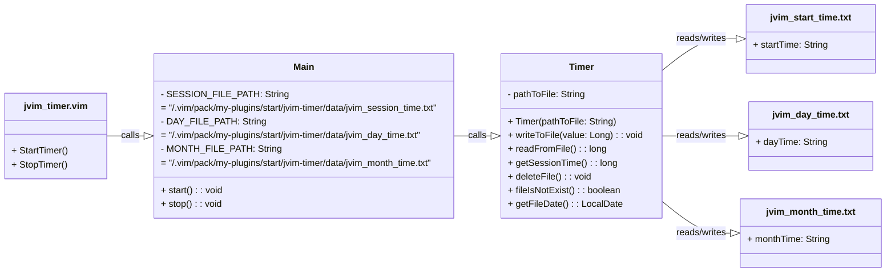

<div align="center">

  <a id="english"></a>
  <h1>Simple Vim Working Time Measurement Plugin</h1>
  <p>Designed for self-monitoring and productivity</p>

  [](#english)
  [](#russian)
  
  
  
  

</div>

<div align="center">
  <h4>Plugin installation</h4>
</div>

* Clone the plugins repository:
```
git clone https://github.com/AlexandrAnatoliev/jvim-plugins 
```

* Navigate to the plugin's root repository:
```
cd jvim-plugins/jvim-timer/
```

* Make the scripts executable:
```
chmod +x scripts/*.sh
```

* Install the plugin using the script:
  - with test execution:
```
./scripts/install_plugin.sh
```
  - without running tests:
```
./scripts/install_plugin_without_testing.sh
```

<div align="center">
  <h4>Plugin uninstallation</h4>
</div>

* To uninstall the plugin, delete its folder:
```
rm -r ~/.vim/pack/my-plugins/start/jvim-timer/
```

<div align="center">
  <h4>Plugin file structure</h4>
</div>

* The plugin installs into the relevant directory of the `.vim/`
folder and creates the following file structure:

```
~/.vim/
└── pack/
    └── my-plugins/
        └── start/
            └── jvim-timer/
                ├── bin/
                │   ├── main/
                │   │   ├── Main.class
                │   │   └── Timer.class
                │   └── test/
                │       └── TimerTest.class
                ├── data/
                │   ├── jvim_day_time.txt
                │   ├── jvim_month_time.txt
                │   └── jvim_session_time.txt
                ├── plugin/
                │   └── jvim_timer.vim
                ├── scripts/
                │   ├── build.sh
                │   ├── check_jdk.sh
                │   ├── check_junit.sh
                │   ├── check_vim.sh
                │   ├── compile.sh
                │   ├── compile_tests.sh
                │   ├── copy_to_vim.sh
                │   ├── install_plugin.sh
                │   ├── install_plugin_without_testing.sh
                │   ├── run_tests.sh
                │   └── testing.sh
                └── src/
                    ├── main/
                    │   └── java/
                    │       ├── Main.java
                    │       └── Timer.java
                    └── test/
                        └── java/
                            └── TimerTest.java
```

<div align="center">
  <h4>Script usage</h4>
</div>

The `install_plugin.sh` script runs the scripts sequentially:
* `build.sh` - building plugin Java files;
* `testing.sh` - running JUnit tests;
* `copy_to_vim.sh` - copies the build plugin to the appropriate Vim
                    directory;

The `install_plugin_without_testing.sh` script runs the scripts 
sequentially without testing:
* `build.sh`
* `copy_to_vim.sh`

* Run the script for automatic plugin build:
```
./scripts/build.sh
```

This script runs the scripts listed below:
* Check if Vim is installed on the system
```
./scripts/check_vim.sh
```

* Check if JDK is installed on the system
```
./scripts/check_jdk.sh
```

* Compiling Java files 
```
./scripts/compile.sh
```

* Run the script for automatic compilation and test execution
```
./scripts/testing.sh
```

This script runs the scripts listed below:
* Check if JUnit is installed on the system
```
./scripts/check_junit.sh
```

* Compiling JUnit classes 
```
./scripts/compile_tests.sh
```

* Run tests:
```
./scripts/run_tests.sh
```

<div align="center">
  <h4>Manual installation</h4>
</div>

* Copy the plugin to the  `.vim/` folder:
```
cp -r jvim-timer/ ~/.vim/pack/my-plugins/start/
```

* Navigate to the plugin's root directory:
```
cd ~/.vim/pack/my-plugins/start/jvim-timer/
```

* Compile Java files:
```
javac -d bin/main/ src/main/java/*
```

* Reload Vim or run the command:
```
:source ~/.vim/pack/my-plugins/start/jvim-timer/plugin/jvim_timer.vim
```

<div align="center">
  <h4>Testing</h4>
</div>

* Building tests with JUnit dependencies:
```
javac -d bin/test/ -cp "bin/main:/usr/share/java/junit-jupiter-api-5.10.1.jar:/usr/share/java/junit-platform-console-standalone-1.9.1.jar" src/test/java/*.java
```

* Running all unit tests
```
java -cp "bin/main:bin/test:/usr/share/java/junit-jupiter-api-5.10.1.jar:/usr/share/java/junit-platform-console-standalone-1.9.1.jar" org.junit.platform.console.ConsoleLauncher --scan-classpath --class-path bin/test
```

<div align="center">
  <h4>Using</h4>
</div>

* Use Vim to edit the file:
```
$ vim example.md
```

* After closing Vim, you will see:
```
  =========================================
            Время работы Vim:           
  -----------------------------------------
  - за сеанс:             0 ч  0 мин  2 сек
  - за день:              0 ч 50 мин  3 сек
  - за месяц (среднее):   0 ч 50 мин  3 сек
  =========================================
```

<div align="center">
  <h4>Requirements</h4>
</div>
 
* Java installed
* Vim installed
* .class files built into designated folder
* JUnit 5 installed (optional)

<div align="center">
  <h4>Compatibility</h4>
</div>
 
* Vim 7.0 and above
* Java 8 and above

<div align="center">
  <h4>Class call hierarchy</h4>
</div>



<div align="center">

  <a id="russian"></a>
  <h1>Простой плагин для измерения времени работы Vim</h1>
  <p>Нужен для самоконтроля и производительности</p>

  [](#english)
  [](#russian)
  
  
  
  

</div>

<div align="center">
  <h4>Установка плагина</h4>
</div>

* Клонировать репозиторий с плагинами:
```
git clone https://github.com/AlexandrAnatoliev/jvim-plugins 
```

* Перейти в корневой каталог плагина:
```
cd jvim-plugins/jvim-timer/
```

* Сделать скрипты исполняемыми:
```
chmod +x scripts/*.sh
```

* Установить плагин с помощью скрипта:
  - с запуском тестов:
```
./scripts/install_plugin.sh
```
  - без запуска тестов:
```
./scripts/install_plugin_without_testing.sh
```

<div align="center">
  <h4>Удаление плагина</h4>
</div>

* Чтобы удалить плагин, удалите директорию с плагином:
```
rm -r ~/.vim/pack/my-plugins/start/jvim-timer/
```

<div align="center">
  <h4>Файловая структура плагина</h4>
</div>

* Плагин устанавливается в соответствующую директорию папки `.vim/`
и образует следующую файловую структуру:

```
~/.vim/
└── pack/
    └── my-plugins/
        └── start/
            └── jvim-timer/
                ├── bin/
                │   ├── main/
                │   │   ├── Main.class
                │   │   └── Timer.class
                │   └── test/
                │       └── TimerTest.class
                ├── data/
                │   ├── jvim_day_time.txt
                │   ├── jvim_month_time.txt
                │   └── jvim_session_time.txt
                ├── plugin/
                │   └── jvim_timer.vim
                ├── scripts/
                │   ├── build.sh
                │   ├── check_jdk.sh
                │   ├── check_junit.sh
                │   ├── check_vim.sh
                │   ├── compile.sh
                │   ├── compile_tests.sh
                │   ├── copy_to_vim.sh
                │   ├── install_plugin.sh
                │   ├── install_plugin_without_testing.sh
                │   ├── run_tests.sh
                │   └── testing.sh
                └── src/
                    ├── main/
                    │   └── java/
                    │       ├── Main.java
                    │       └── Timer.java
                    └── test/
                        └── java/
                            └── TimerTest.java
```

<div align="center">
  <h4>Использование скриптов</h4>
</div>

Скрипт `install_plugin.sh` последовательно запускает скрипты:
* `build.sh` - сборка Java файлов плагина;
* `testing.sh` - запуск JUnit тестов;
* `copy_to_vim.sh` - копирует собранный плагин в соответствующую Vim
                    директорию;

Скрипт `install_plugin_without_testing.sh` последовательно запускает 
скрипты, пропуская тестирование:
* `build.sh`
* `copy_to_vim.sh`

* Запустить скрипт для автоматической сборки:
```
./scripts/build.sh
```

Этот скрипт запускает следующие скрипты:
* Проверить, установлен ли Vim в системе
```
./scripts/check_vim.sh
```

* Проверить, установлен ли JDK в системе
```
./scripts/check_jdk.sh
```

* Компиляция Java файлов 
```
./scripts/compile.sh
```

* Запустить скрипт для автоматической компиляции и запуска тестов
```
./scripts/testing.sh
```

Этот скрипт запускает следующие скрипты:
* Проверяет установлен ли JUnit в системе
```
./scripts/check_junit.sh
```

* Компилирует JUnit классы 
```
./scripts/compile_tests.sh
```

* Запуск тестов:
```
./scripts/run_tests.sh
```

<div align="center">
  <h4>Установка вручную</h4>
</div>

* Скопировать плагин в .vim/ директорию:
```
cp -r jvim-timer/ ~/.vim/pack/my-plugins/start/
```

* Перейти в корневой каталог плагина:
```
cd ~/.vim/pack/my-plugins/start/jvim-timer/
```

* Скомпилировать Java файлы:
```
javac -d bin/main/ src/main/java/*
```

* Перезагрузить Vim или выполнить команду:
```
:source ~/.vim/pack/my-plugins/start/jvim-timer/plugin/jvim_timer.vim
```

<div align="center">
  <h4>Тестирование</h4>
</div>

* Компиляция тестов с зависимостями JUnit:
```
javac -d bin/test/ -cp "bin/main:/usr/share/java/junit-jupiter-api-5.10.1.jar:/usr/share/java/junit-platform-console-standalone-1.9.1.jar" src/test/java/*.java
```

* Запуск всех unit-тестов
```
java -cp "bin/main:bin/test:/usr/share/java/junit-jupiter-api-5.10.1.jar:/usr/share/java/junit-platform-console-standalone-1.9.1.jar" org.junit.platform.console.ConsoleLauncher --scan-classpath --class-path bin/test
```

<div align="center">
  <h4>Использование</h4>
</div>

* Воспользоваться Vim для редактирования файла:
```
$ vim example.md
```

* По окончании работы и закрытия Vim будет выведено:
```
  =========================================
            Время работы Vim:           
  -----------------------------------------
  - за сеанс:             0 ч  0 мин  2 сек
  - за день:              0 ч 50 мин  3 сек
  - за месяц (среднее):   0 ч 50 мин  3 сек
  =========================================
```

<div align="center">
  <h4>Требования</h4>
</div>
 
* Установленная Java
* Установленный Vim
* Установленный JUnit 5 (опционально)
* Скомпилированные .class файлы в указанной директории

<div align="center">
  <h4>Совместимость</h4>
</div>
 
* Vim 7.0 и выше
* Java 8 и выше

<div align="center">
  <h4>Структура вызовов классов</h4>
</div>


