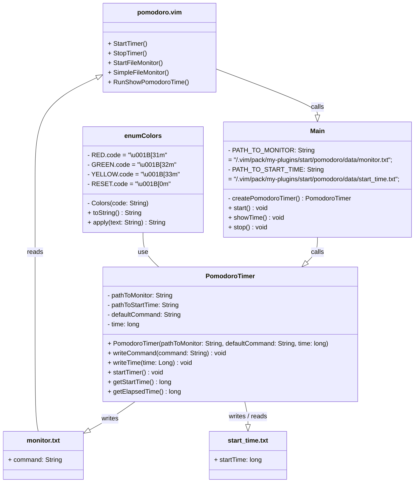

<div align="center">

  <a id="english"></a>
  <h1>Vim pomodoro plugin</h1>
  <p>Designed for self-monitoring and productivity</p>

  [](#english)
  [](#russian)
  
  
  

</div>

<div align="center">
  <h4>Plugin file structure</h4>
</div>

* The plugin installs into the relevant directory of the `.vim/`
folder and creates the following file structure:

```
pomodoro
├── bin
│  ├── main
│  │  ├── Colors.class
│  │  ├── Main.class
│  │  └── PomodoroTimer.class
│  └── test
│     └── PomodoroTimerTest.class
├── data
│  ├── monitor.txt
│  └── start_time.txt
├── plugin
│  └── pomodoro.vim
├── pom.xml
├── README.md
├── src
│  ├── main
│  │  └── java
│  │     ├── Colors.java
│  │     ├── Main.java
│  │     └── PomodoroTimer.java
│  └── test
│     └── java
│        └── PomodoroTimerTest.java
└── target
   ├── classes
   │  ├── Colors.class
   │  ├── Main.class
   │  └── PomodoroTimer.class
   ├── generated-sources
   │  └── annotations
   ├── generated-test-sources
   │  └── test-annotations
   ├── maven-archiver
   │  └── pom.properties
   ├── maven-status
   │  └── maven-compiler-plugin
   │     ├── compile
   │     │  └── default-compile
   │     │     ├── createdFiles.lst
   │     │     └── inputFiles.lst
   │     └── testCompile
   │        └── default-testCompile
   │           ├── createdFiles.lst
   │           └── inputFiles.lst
   ├── pomodoro-0.8.6.jar
   ├── surefire-reports
   │  ├── PomodoroTimerTest.txt
   │  └── TEST-PomodoroTimerTest.xml
   └── test-classes
      └── PomodoroTimerTest.class
```

<div align="center">
  <h4>Manual installation</h4>
</div>

* Build plugin by Maven
```
mvn package
```

* Copy the plugin to the  `.vim/` folder:
```
cp -r pomodoro/ ~/.vim/pack/my-plugins/start/
```

* Reload Vim or run the command:
```
:source ~/.vim/pack/my-plugins/start/pomodoro/plugin/pomodoro.vim
```

<div align="center">
  <h4>Plugin uninstallation</h4>
</div>

* To uninstall the plugin, delete its folder:
```
rm -r ~/.vim/pack/my-plugins/start/pomodoro/
```

<div align="center">
  <h4>Testing</h4>
</div>

* Running all unit tests
```
mvn test
```

<div align="center">
  <h4>Using</h4>
</div>

* Use Vim to edit the file:
```
$ vim example.md
```

* After 25 minutes it will change Vim's color scheme to remind you 
that it's time to take a break.

<div align="center">
  <h4>Requirements</h4>
</div>
 
* Java installed
* Vim installed
* Maven installed
* .class files built into designated folder
* JUnit 5 installed (optional)

<div align="center">
  <h4>Compatibility</h4>
</div>
 
* Vim 7.0 and above
* Java 8 and above
* Maven 3 and above

<div align="center">
  <h4>Class call hierarchy</h4>
</div>



<div align="center">

  <a id="russian"></a>
  <h1>Pomodoro плагин для Vim</h1>
  <p>Нужен для самоконтроля и производительности</p>

  [](#english)
  [](#russian)
  
  
  

</div>

<div align="center">
  <h4>Файловая структура плагина</h4>
</div>

* Плагин устанавливается в соответствующую директорию папки `.vim/`
и образует следующую файловую структуру:

```
pomodoro
```
pomodoro
├── bin
│  ├── main
│  │  ├── Colors.class
│  │  ├── Main.class
│  │  └── PomodoroTimer.class
│  └── test
│     └── PomodoroTimerTest.class
├── data
│  ├── monitor.txt
│  └── start_time.txt
├── plugin
│  └── pomodoro.vim
├── pom.xml
├── README.md
├── src
│  ├── main
│  │  └── java
│  │     ├── Colors.java
│  │     ├── Main.java
│  │     └── PomodoroTimer.java
│  └── test
│     └── java
│        └── PomodoroTimerTest.java
└── target
   ├── classes
   │  ├── Colors.class
   │  ├── Main.class
   │  └── PomodoroTimer.class
   ├── generated-sources
   │  └── annotations
   ├── generated-test-sources
   │  └── test-annotations
   ├── maven-archiver
   │  └── pom.properties
   ├── maven-status
   │  └── maven-compiler-plugin
   │     ├── compile
   │     │  └── default-compile
   │     │     ├── createdFiles.lst
   │     │     └── inputFiles.lst
   │     └── testCompile
   │        └── default-testCompile
   │           ├── createdFiles.lst
   │           └── inputFiles.lst
   ├── pomodoro-0.8.6.jar
   ├── surefire-reports
   │  ├── PomodoroTimerTest.txt
   │  └── TEST-PomodoroTimerTest.xml
   └── test-classes
      └── PomodoroTimerTest.class
```
```

<div align="center">
  <h4>Установка вручную</h4>
</div>

* Соберите плагин с помощью maven:
```
mvn package
```

* Скопировать плагин в .vim/ директорию:
```
cp -r pomodoro/ ~/.vim/pack/my-plugins/start/
```

* Перезагрузить Vim или выполнить команду:
```
:source ~/.vim/pack/my-plugins/start/pomodoro/plugin/pomodoro.vim
```

<div align="center">
  <h4>Удаление плагина</h4>
</div>

* Чтобы удалить плагин, удалите директорию с плагином:
```
rm -r ~/.vim/pack/my-plugins/start/pomodoro/
```

<div align="center">
  <h4>Тестирование</h4>
</div>

* Запуск всех тестов
```
mvn test
```

<div align="center">
  <h4>Использование</h4>
</div>

* Воспользоваться Vim для редактирования файла:
```
$ vim example.md
```

* Через 25 минут цветовая схема Vim изменится, чтобы напомнить Вам,
что необходимо отдохнуть.

<div align="center">
  <h4>Требования</h4>
</div>
 
* Установленная Java
* Установленный Vim
* Установленный Maven
* Установленный JUnit 5 (опционально)
* Скомпилированные .class файлы в указанной директории

<div align="center">
  <h4>Совместимость</h4>
</div>
 
* Vim 7.0 и выше
* Java 8 и выше
* Maven 3 и выше

<div align="center">
  <h4>Структура вызовов классов</h4>
</div>


