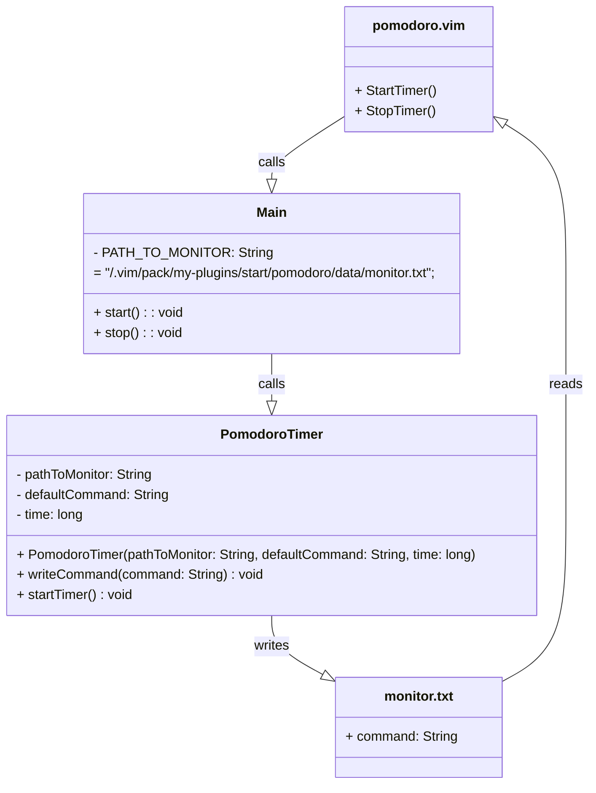

<div align="center">

  <a id="english"></a>
  <h1>Vim pomodoro plugin</h1>
  <p>Designed for self-monitoring and productivity</p>

  [](#english)
  [](#russian)
  
  
  

</div>

<div align="center">
  <h4>Plugin installation</h4>
</div>

* Clone the plugins repository:
```
git clone https://github.com/AlexandrAnatoliev/jvim-plugins 
```

* Navigate to the plugin's root repository:
```
cd jvim-plugins/pomodoro/
```

<div align="center">
  <h4>Plugin uninstallation</h4>
</div>

* To uninstall the plugin, delete its folder:
```
rm -r ~/.vim/pack/my-plugins/start/pomodoro/
```

<div align="center">
  <h4>Plugin file structure</h4>
</div>

* The plugin installs into the relevant directory of the `.vim/`
folder and creates the following file structure:

```
pomodoro
├── bin
│  ├── main
│  │  ├── Main.class
│  │  └── PomodoroTimer.class
│  └── test
│     └── PomodoroTimerTest.class
├── data
│  └── monitor.txt
├── plugin
│  └── pomodoro.vim
├── README.md
└── src
   ├── main
   │  └── java
   │     ├── Main.java
   │     └── PomodoroTimer.java
   └── test
      └── java
         └── PomodoroTimerTest.java
```

<div align="center">
  <h4>Manual installation</h4>
</div>

* Copy the plugin to the  `.vim/` folder:
```
cp -r pomodoro/ ~/.vim/pack/my-plugins/start/
```

* Navigate to the plugin's root directory:
```
cd ~/.vim/pack/my-plugins/start/pomodoro/
```

* Compile Java files:
```
javac -d bin/main/ src/main/java/*
```

* Reload Vim or run the command:
```
:source ~/.vim/pack/my-plugins/start/pomodoro/plugin/pomodoro.vim
```

<div align="center">
  <h4>Testing</h4>
</div>

* Check the path to JUnit using command: 
```
dpkg -L junit5
```

* Building tests with JUnit dependencies:
```
javac -d bin/test/ -cp "bin/main:/usr/share/java/junit-jupiter-api-5.10.1.jar:/usr/share/java/junit-platform-console-standalone-1.9.1.jar" src/test/java/*.java
```

* Running all unit tests
```
java -cp "bin/main:bin/test:/usr/share/java/junit-jupiter-api-5.10.1.jar:/usr/share/java/junit-platform-console-standalone-1.9.1.jar" org.junit.platform.console.ConsoleLauncher --scan-classpath --class-path bin/test
```

<div align="center">
  <h4>Using</h4>
</div>

* Use Vim to edit the file:
```
$ vim example.md
```

* After 25 minutes it will change Vim's color scheme to remind you 
that it's time to take a break.

<div align="center">
  <h4>Requirements</h4>
</div>
 
* Java installed
* Vim installed
* .class files built into designated folder
* JUnit 5 installed (optional)

<div align="center">
  <h4>Compatibility</h4>
</div>
 
* Vim 7.0 and above
* Java 8 and above

<div align="center">
  <h4>Class call hierarchy</h4>
</div>



<div align="center">

  <a id="russian"></a>
  <h1>Pomodoro плагин дляVim</h1>
  <p>Нужен для самоконтроля и производительности</p>

  [](#english)
  [](#russian)
  
  
  

</div>

<div align="center">
  <h4>Установка плагина</h4>
</div>

* Клонировать репозиторий с плагинами:
```
git clone https://github.com/AlexandrAnatoliev/jvim-plugins 
```

* Перейти в корневой каталог плагина:
```
cd jvim-plugins/pomodoro/
```

<div align="center">
  <h4>Удаление плагина</h4>
</div>

* Чтобы удалить плагин, удалите директорию с плагином:
```
rm -r ~/.vim/pack/my-plugins/start/pomodoro/
```

<div align="center">
  <h4>Файловая структура плагина</h4>
</div>

* Плагин устанавливается в соответствующую директорию папки `.vim/`
и образует следующую файловую структуру:

```
pomodoro
├── bin
│  ├── main
│  │  ├── Main.class
│  │  └── PomodoroTimer.class
│  └── test
│     └── PomodoroTimerTest.class
├── data
│  └── monitor.txt
├── plugin
│  └── pomodoro.vim
├── README.md
└── src
   ├── main
   │  └── java
   │     ├── Main.java
   │     └── PomodoroTimer.java
   └── test
      └── java
         └── PomodoroTimerTest.java
```

<div align="center">
  <h4>Установка вручную</h4>
</div>

* Скопировать плагин в .vim/ директорию:
```
cp -r pomodoro/ ~/.vim/pack/my-plugins/start/
```

* Перейти в корневой каталог плагина:
```
cd ~/.vim/pack/my-plugins/start/pomodoro/
```

* Скомпилировать Java файлы:
```
javac -d bin/main/ src/main/java/*
```

* Перезагрузить Vim или выполнить команду:
```
:source ~/.vim/pack/my-plugins/start/pomodoro/plugin/pomodoro.vim
```

<div align="center">
  <h4>Тестирование</h4>
</div>

* Проверьте путь до классов JUnit командой: 
```
dpkg -L junit5
```

* Компиляция тестов с зависимостями JUnit:
```
javac -d bin/test/ -cp "bin/main:/usr/share/java/junit-jupiter-api-5.10.1.jar:/usr/share/java/junit-platform-console-standalone-1.9.1.jar" src/test/java/*.java
```

* Запуск всех unit-тестов
```
java -cp "bin/main:bin/test:/usr/share/java/junit-jupiter-api-5.10.1.jar:/usr/share/java/junit-platform-console-standalone-1.9.1.jar" org.junit.platform.console.ConsoleLauncher --scan-classpath --class-path bin/test
```

<div align="center">
  <h4>Использование</h4>
</div>

* Воспользоваться Vim для редактирования файла:
```
$ vim example.md
```

* Через 25 минут цветовая схема Vim изменится, чтобы напомнить Вам,
что необходимо отдохнуть.

<div align="center">
  <h4>Требования</h4>
</div>
 
* Установленная Java
* Установленный Vim
* Установленный JUnit 5 (опционально)
* Скомпилированные .class файлы в указанной директории

<div align="center">
  <h4>Совместимость</h4>
</div>
 
* Vim 7.0 и выше
* Java 8 и выше

<div align="center">
  <h4>Структура вызовов классов</h4>
</div>


