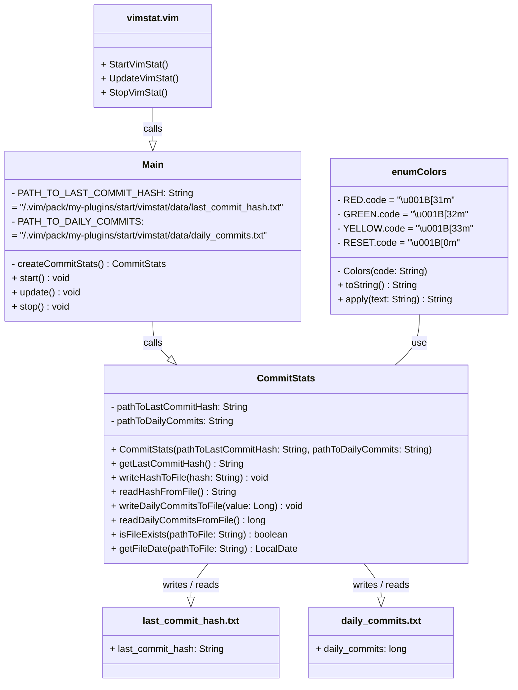

<div align="center">
  <a id="english"></a>
  <h1>Vim stats plugin</h1>
  <p>Vim utility to get stats</p>

  [](#english)
  [](#russian)
  
  
  
</div>

<div align="center">
  <h4>Plugin file structure</h4>
</div>

* The plugin installs into the relevant directory of the `.vim/`
folder and creates the following file structure:

```
vimstat/
├── data
│  ├── daily_commits.txt
│  └── last_commit_hash.txt
├── plugin
│  └── vimstat.vim
├── pom.xml
├── README.md
├── src
│  └── main
│     └── java
│        ├── Colors.java
│        ├── CommitStats.java
│        └── Main.java
└── target
   ├── classes
   │  ├── Colors.class
   │  ├── CommitStats.class
   │  └── Main.class
   ├── generated-sources
   │  └── annotations
   ├── generated-test-sources
   │  └── test-annotations
   ├── maven-archiver
   │  └── pom.properties
   ├── maven-status
   │  └── maven-compiler-plugin
   │     ├── compile
   │     │  └── default-compile
   │     │     ├── createdFiles.lst
   │     │     └── inputFiles.lst
   │     └── testCompile
   │        └── default-testCompile
   │           ├── createdFiles.lst
   │           └── inputFiles.lst
   ├── test-classes
   └── vimstat-0.8.0.jar
```

<div align="center">
  <h4>Manual installation</h4>
</div>

* Build plugin by Maven
```
mvn package
```

* Copy the plugin to the  `.vim/` folder:
```
cp -r commit-stats/ ~/.vim/pack/my-plugins/start/
```

* Reload Vim or run the command:
```
:source ~/.vim/pack/my-plugins/start/commit-stats/plugin/vimstat.vim
```

<div align="center">
  <h4>Plugin uninstallation</h4>
</div>

* To uninstall the plugin, delete its folder:
```
rm -r ~/.vim/pack/my-plugins/start/vimstat/
```

<div align="center">
  <h4>Testing</h4>
</div>

* Running all unit tests
```
mvn test
```

<div align="center">
  <h4>Using</h4>
</div>

* Use Vim to edit the file:
```
$ vim example.md
```

* After closing Vim, you will see:
```
  =========================================
              Commit stats:
  -----------------------------------------
  - Commits for day: 0
  =========================================
```

<div align="center">
  <h4>Requirements</h4>
</div>
 
* Java installed
* Vim installed
* Maven installed
* .class files built into designated folder
* JUnit 5 installed (optional)

<div align="center">
  <h4>Compatibility</h4>
</div>
 
* Vim 7.0 and above
* Java 8 and above
* Maven 3 and above

<div align="center">
  <h4>Class call hierarchy</h4>
</div>



<div align="center">
  <a id="russian"></a>
  <h1>Vim stats plugin</h1>
  <p>Vim-утилита для получения статистики</p>

  [](#english)
  [](#russian)
  
  
  
</div>

<div align="center">
  <h4>Структура файлов плагина</h4>
</div>

* Плагин устанавливается в соответствующую директорию папки `.vim/`
и создает следующую структуру файлов:

```
vimstat/
├── data
│  ├── daily_commits.txt
│  └── last_commit_hash.txt
├── plugin
│  └── vimstat.vim
├── pom.xml
├── README.md
├── src
│  └── main
│     └── java
│        ├── Colors.java
│        ├── CommitStats.java
│        └── Main.java
└── target
   ├── classes
   │  ├── Colors.class
   │  ├── CommitStats.class
   │  └── Main.class
   ├── generated-sources
   │  └── annotations
   ├── generated-test-sources
   │  └── test-annotations
   ├── maven-archiver
   │  └── pom.properties
   ├── maven-status
   │  └── maven-compiler-plugin
   │     ├── compile
   │     │  └── default-compile
   │     │     ├── createdFiles.lst
   │     │     └── inputFiles.lst
   │     └── testCompile
   │        └── default-testCompile
   │           ├── createdFiles.lst
   │           └── inputFiles.lst
   ├── test-classes
   └── vimstat-0.8.0.jar
```

<div align="center">
  <h4>Ручная установка</h4>
</div>

* Соберите плагин с помощью maven:
```
mvn package
```

* Скопируйте плагин в папку `.vim/`:
```
cp -r commit-stats/ ~/.vim/pack/my-plugins/start/
```

* Перезагрузите Vim или выполните команду:
```
:source ~/.vim/pack/my-plugins/start/commit-stats/plugin/vimstat.vim
```

<div align="center">
  <h4>Удаление плагина</h4>
</div>

* Чтобы удалить плагин, удалите его папку:
```
rm -r ~/.vim/pack/my-plugins/start/vimstat/
```

<div align="center">
  <h4>Тестирование</h4>
</div>

* Запуск всех тестов
```
mvn test
```


<div align="center">
  <h4>Использование</h4>
</div>

* Воспользуйтесь Vim для редактирования файла:
```
$ vim example.md
```

* После закрытия Vim, вы увидите:
```
  =========================================
              Commit stats:
  -----------------------------------------
  - Commits for day: 0
  =========================================
```

<div align="center">
  <h4>Требования</h4>
</div>
 
* Установленная Java 
* Установленный Vim 
* Установленный Maven
* Скомпилированные .class файлы в соответствующей папке
* Установленный JUnit 5 (опционально)

<div align="center">
  <h4>Совместимость</h4>
</div>
 
* Vim 7.0 и выше
* Java 8 и выше
* Maven 3 и выше

<div align="center">
  <h4>Иерархия классов</h4>
</div>


